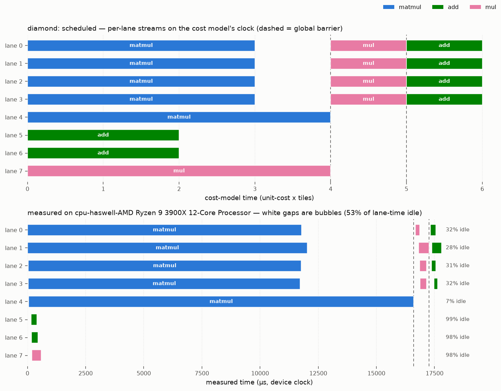

# pjrt-ocl

**Run JAX on any OpenCL device.** `pjrt-ocl` is a [PJRT](https://openxla.org/xla/pjrt)
plugin that lets `jax.jit` execute on OpenCL-capable hardware — Intel, AMD, NVIDIA,
or a CPU via [PoCL](https://portablecl.org/) — with no vendor SDK (no CUDA, no ROCm)
on the execution path.

> ⚠️ **Experimental / work in progress.** A growing subset of StableHLO ops across the
> full JAX dtype matrix (f32/f64/i32/u32/i64/bool/f16/bf16), not yet on PyPI. Validated
> end-to-end on an NVIDIA RTX PRO 6000 (via NVIDIA's OpenCL) and on PoCL (CPU). Not
> affiliated with Google, OpenXLA, or the JAX project.

## How it works

JAX lowers your `jit`-compiled function to StableHLO. Instead of JIT-compiling a kernel
per dispatch, `pjrt-ocl` lowers StableHLO **once** into a compact **bytecode** — a flat
list of tile-ops with a per-lane schedule. At run time a single persistent OpenCL
megakernel (the "VLIW VM") interprets that bytecode: each workgroup is a *lane* running
its own instruction stream, with different lanes running different ops in parallel and
synchronizing at scheduler-placed barriers. The generic OpenCL kernel library is compiled
**once** per device at plugin init — the OpenCL compiler is never invoked on the hot path.

```
jax.jit(f)  ──►  StableHLO  ──►  lowering (Python)  ──►  VMProgram bytecode
                                                              │
                                          device-side bytecode VM (one megakernel)
                                                              ▼
                                                     results on the OpenCL device
```

## Requirements

- Python ≥ 3.10, with `jax` / `jaxlib` installed (developed against **jax 0.10.2**).
- An OpenCL 1.2+ runtime and an ICD for your device. Check with `clinfo -l`.
  - NVIDIA: the CUDA driver ships an OpenCL ICD.
  - CPU dev/testing: `sudo apt install pocl-opencl-icd`.
- To build the plugin: a C++20 compiler, `cmake`, `ninja`, and OpenCL headers
  (`sudo apt install opencl-headers ocl-icd-opencl-dev cmake ninja-build clinfo`).

## Installation

`pip install` builds the C++ plugin (via cmake/scikit-build-core) and bundles it with
the Python package — no manual build step. You need the build prerequisites on the
system first: **cmake, ninja, and OpenCL dev headers** (Ubuntu:
`sudo apt install cmake ninja-build opencl-headers ocl-icd-opencl-dev`), plus an ICD
for your device (see [Requirements](#requirements)).

```bash
pip install "git+https://github.com/llandsmeer-ai/pjrt-ocl.git"
```

That's it — the `JAX_PLATFORMS=opencl` example below works immediately.

<details>
<summary>Development install (editable, no rebuild-on-edit for the C++)</summary>

For hacking on the plugin, build the `.so` and use an editable Python install:

```bash
git clone https://github.com/llandsmeer-ai/pjrt-ocl.git && cd pjrt-ocl
cmake -S pjrt_plugin -B pjrt_plugin/build -G Ninja && cmake --build pjrt_plugin/build
pip install -e python/    # finds the .so in the build tree automatically
```

The loader searches `PJRT_OCL_PLUGIN_PATH` → the `.so` bundled in the package → the
dev build tree, and prints a clear error if none is found.
</details>

Check JAX sees the device:

```bash
JAX_PLATFORMS=opencl python -c "import jax; print(jax.devices())"
# [OclDevice(id=0)]   # .device_kind shows the platform/device name string
```

## Quickstart

```python
import os
os.environ["JAX_PLATFORMS"] = "opencl"      # use the OpenCL backend

import jax, jax.numpy as jnp

@jax.jit
def f(a, b):
    return jnp.maximum(a @ b, 0.0)          # matmul + relu, fused on device

x = jnp.ones((256, 128), jnp.float32)
w = jnp.ones((128, 64),  jnp.float32)
print(f(x, w).shape)                         # (256, 64)
```

### Choosing a device

`pjrt-ocl` picks the first GPU (else the first CPU) by default. Override with a platform
name substring and optional device index:

```bash
PJRT_OCL_DEVICE="NVIDIA"        python your_script.py   # NVIDIA CUDA OpenCL
PJRT_OCL_DEVICE="Portable"      python your_script.py   # PoCL (CPU)
PJRT_OCL_DEVICE="Intel:1"       python your_script.py   # 2nd Intel device
```

## Supported ops

52 StableHLO ops, grown test-first — each verified against JAX's CPU backend. Full
scoreboard: [`tests/SCOREBOARD.md`](tests/SCOREBOARD.md).

- **Elementwise** — add, subtract, multiply, divide, remainder, pow, max, min, atan2;
  negate, abs, sign, exp, expm1, log, log1p, sqrt, rsqrt, cbrt, sin, cos, tan, tanh,
  floor, ceil, round (even & away-from-zero), is_finite; clamp; and/or/xor/not;
  compare (all directions), select.
- **Type** — `convert` (any dtype ↔ any dtype), `bitcast_convert`.
- **Shape** — `broadcast_in_dim`, `transpose`, `reshape`, `slice` (strided), `reverse`,
  `concatenate`, `pad` (as strided gathers/scatters).
- **Dynamic indexing** — `dynamic_slice`, `dynamic_update_slice`.
- **Reductions** — `reduce` (full sum / max / min / prod, f32 & i32), `reduce_window`
  (pooling, with strides & padding).
- **Linear algebra** — `dot_general` (plain 2D matmul, register-blocked tile kernel).
- **Making** — `iota`, `constant`.
- **Control flow** — `while` (interpreted on device by a frame-stack VM).

**Dtypes** — f32, f64 (where `cl_khr_fp64` is present), i32, u32, i64, bool, f16, bf16.
f16/bf16 use 2-byte storage with f32 compute (portable, no `cl_khr_fp16` required).

Anything unsupported raises a clear `LoweringError` naming the op.

## Performance

Correctness comes first; performance is early. Below is per-op wall-clock vs
problem size N — **our OpenCL backend against JAX's native CUDA (XLA + cuBLAS)
on the same GPU** (NVIDIA RTX PRO 6000 Blackwell), so it's an apples-to-apples
GPU-vs-GPU comparison of the VM against a production compiler.


Takeaways (higher = slower; both axes log):

- **Small sizes are dispatch-bound and competitive** — within ~1.3x of CUDA for
  elementwise/gather, since both are dominated by launch/execute overhead.
- **Large elementwise / gather** run ~4–8x slower: our megakernel is not yet
  bandwidth-optimal (note the step near 512K elements — a lane/tile scaling
  threshold worth tuning).
- **`dot_general`** is ~7.5x off cuBLAS at 2048³ — expected for a naive
  register-blocked tile kernel vs a tuned library; the kernel-table override
  mechanism is the intended path to close this.
- **`while` loops** are the biggest gap (~10–30x): every iteration pays a
  cross-workgroup barrier + control round-trip. Loop-body fusion and cheaper
  per-iteration sync are the obvious wins.

Reproduce (writes `docs/bench_plot.png` + `.csv`; auto-uses native CUDA as the
reference if a CUDA jaxlib is installed, else JAX CPU):

```bash
. ./env.sh && python tools/plot_bench.py --device NVIDIA
```

## Inside the VM: scheduled vs. measured execution

How does a `jax.jit` function actually run on the device? Take a program with both
parallel and sequential structure — a heavy matmul next to a cheap elementwise chain,
joined at the end:

```python
def f(a, b, c):          # all 256x256 f32
    m = a @ b            # heavy matmul            \  independent -> same dataflow
    s = c + c            # cheap elementwise        } level, scheduled onto
    p = c * c            # cheap elementwise       /  different lanes in parallel
    q = s * p            # needs s and p  -> next level (after a global barrier)
    return q + m         # needs q and m  -> final level (the join)
```

The compile pipeline turns this into the per-lane schedule below. Lowering emits one
**task** per op and splits each into **tiles** (16K elements for elementwise, 64×64
output blocks for matmul). The scheduler then groups independent ops into **dataflow
levels**, packs each level's tiles onto **lanes** (persistent workgroups) by cost
(LPT), and separates levels with **global barriers** — that schedule *is* the bytecode
the engines execute. `tools/plot_schedule.py` draws it (top), then runs the program
through the plugin with per-entry instrumentation and draws what the device really did
(bottom):



Reading it, top panel (the scheduler's intent, on its cost model's clock):

- **Level 0**: the matmul's 16 tiles get lanes 0–4 while `c+c` and `c*c` run
  concurrently on lanes 5–7 — independent ops really do run side by side.
- The dashed **barriers** separate levels: `s * p` and the final join each wait for
  every lane, because their inputs were produced across lanes.
- Levels 1–2 have only 4 tiles for 8 lanes: lanes 4–7 are scheduled idle —
  a structural **bubble** visible at schedule time.

Bottom panel (device timestamps from the same program, white gaps = bubbles):

- On this CPU the default cost model is wrong: a matmul tile costs roughly 25× an
  elementwise tile, so lanes 5–7 finish in under a millisecond and then stall at the
  barrier while the matmul lanes grind on — most of the idle time in the run.
  Supplying measured per-tile costs (`--cost-table`, `PJRT_OCL_COST_TABLE`) lets the
  scheduler rebalance exactly this.
- The same command with `--device NVIDIA` shows a much flatter level 0: on that GPU
  a matmul tile and an elementwise tile cost about the same. The schedule is
  device-neutral but the costs are not — which is why per-tile costs are measured
  per device rather than assumed.

Reproduce (any of `diamond`, `chain`, `wide`, or your own StableHLO):

```bash
. ./env.sh
python tools/plot_schedule.py --example diamond --device Portable --out docs/schedule_diamond.png
python tools/plot_schedule.py --stablehlo my_program.mlir      # planned timeline only
```

How the measurement works: `PJRT_OCL_VM_TRACE=<file>` switches execution to the
host-dispatch engine and runs **every schedule entry as its own single-workgroup
launch on a per-lane profiling queue** (lanes still run concurrently — verified on
PoCL and NVIDIA), so each entry gets device-clock start/end timestamps via OpenCL
event profiling, appended as JSON per execute. Two caveats: per-entry launches add
overhead (~tens of µs each), so treat it as a timeline, not a benchmark — and the
GPU megakernel path is not per-entry observable from the host (only barrier arrival
ranks), so traces always reflect the host-dispatch engine.

## Development

```bash
# C++ unit test (executes hand-built bytecode on the device)
cmake --build pjrt_plugin/build && ./pjrt_plugin/build/runtime_test

# Python + end-to-end tests (compares every op against JAX's CPU backend)
pip install -e python/ && python -m pytest tests/

# Per-op perf sweep (lane scaling + vs JAX CPU)
tools/bench_ops.sh
```

The codebase targets OpenCL 3.0-core / the common 1.2 subset; no vendor extensions on the
core path, and it never assumes fp64. Design decisions and their rationale live in
[`docs/decisions.md`](docs/decisions.md); the bytecode format is specified in
[`docs/vmprogram.md`](docs/vmprogram.md) and the execution model in
[`docs/tile-isa.md`](docs/tile-isa.md).

## Limitations & roadmap

- **Op coverage is partial** and grows test-first. Not yet supported: partial-axis
  reductions, batched / non-canonical `dot_general`, `if`/`case` control flow, general
  (data-dependent) gather/scatter, sort. These raise a clear `LoweringError` today.
- **Dtypes**: the full JAX matrix (f32/f64/i32/u32/i64/bool/f16/bf16) is in; f64 is gated
  on `cl_khr_fp64`. Still to come: i8/i16 and complex.
- **Two execution engines, auto-selected.** GPUs run a persistent megakernel with an
  on-device cross-workgroup barrier (device-scope acquire/release fences — correct even for
  cross-lane data under iteration). CPU/non-GPU devices (e.g. PoCL) use a **host-dispatch**
  engine instead: the host drives control flow and enforces the barrier with one kernel
  launch per phase. This is required on CPU — an in-kernel spin-barrier deadlocks on a
  non-preemptive CPU runtime (imbalance-starvation; it's why OpenCL mandates kernel
  boundaries for cross-group sync). Override with `PJRT_OCL_ENGINE=host|mega|auto`.
- Performance is improving but not yet tuned: matmul runs a register-blocked tile kernel;
  memory-bound ops are currently limited by arena-copy traffic (see
  [`docs/perf-findings.md`](docs/perf-findings.md)).

## License

TBD.
