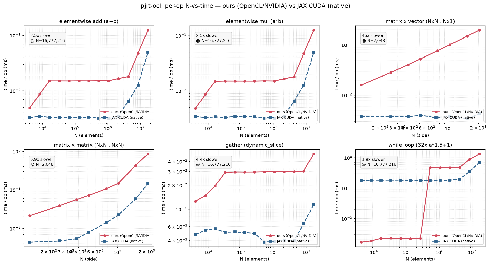
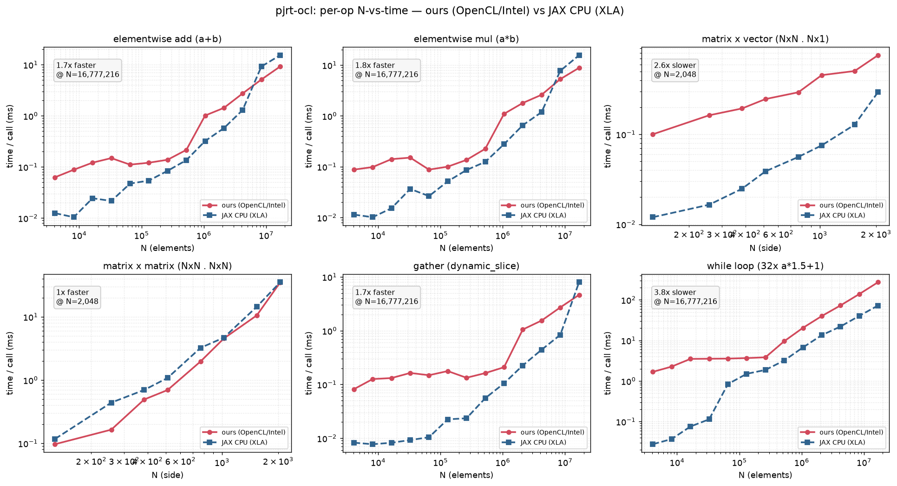
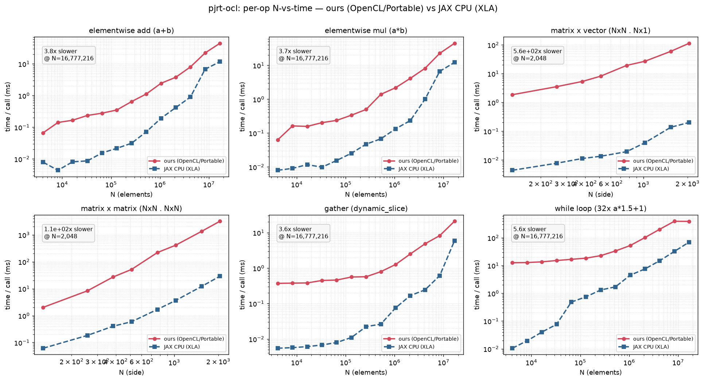
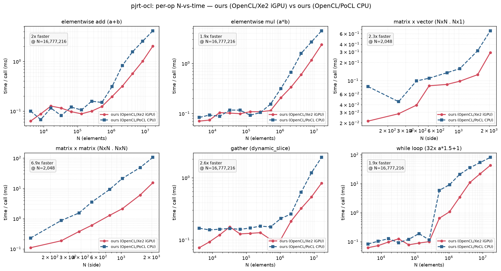
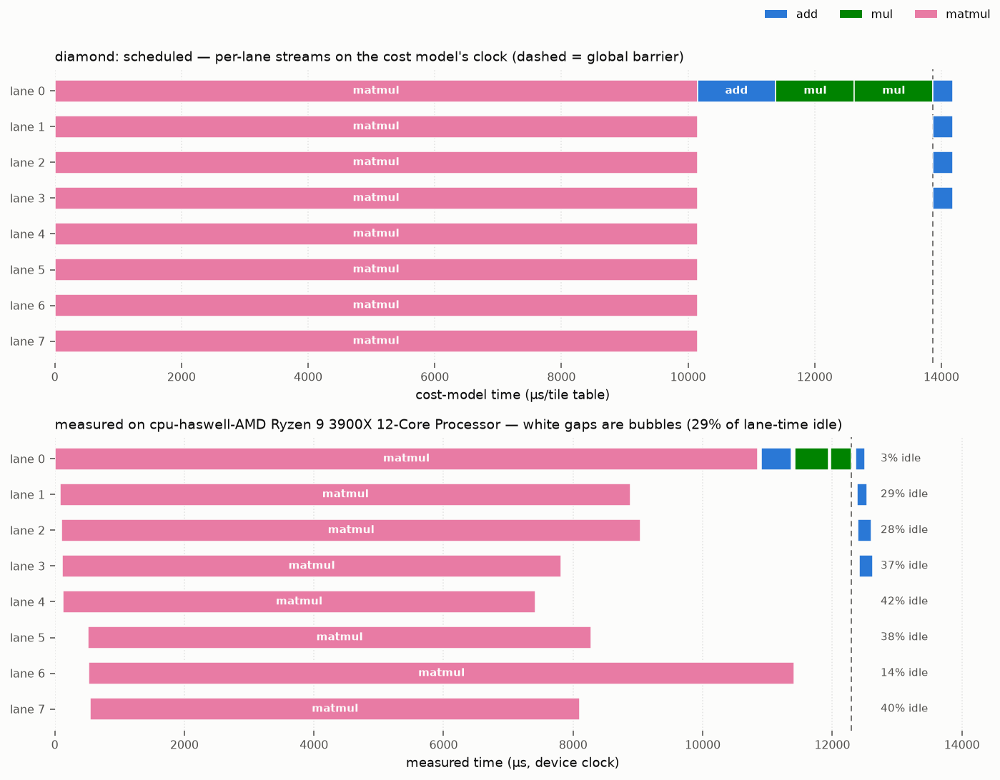

# OpenMegaKernel (pjrt-ocl)

**Run JAX on any OpenCL device.** `pjrt-ocl` is a [PJRT](https://openxla.org/xla/pjrt)
plugin that lets `jax.jit` execute on OpenCL-capable hardware — Intel, AMD, NVIDIA,
or a CPU via [PoCL](https://portablecl.org/) — with no vendor SDK (no CUDA, no ROCm)
on the execution path.

> ⚠️ **Experimental / work in progress.** A growing subset of StableHLO ops across the
> full JAX dtype matrix (f32/f64/i32/u32/i64/bool/f16/bf16), not yet on PyPI. Validated
> end-to-end on an NVIDIA RTX PRO 6000 (via NVIDIA's OpenCL) and on PoCL (CPU). Not
> affiliated with Google, OpenXLA, or the JAX project.

## How it works

JAX lowers your `jit`-compiled function to StableHLO. Instead of JIT-compiling a kernel
per dispatch, `pjrt-ocl` lowers StableHLO **once** into a compact **bytecode** — a flat
list of tile-ops with a per-lane schedule. At run time a single persistent OpenCL
megakernel (the "VLIW VM") interprets that bytecode: each workgroup is a *lane* running
its own instruction stream, with different lanes running different ops in parallel and
synchronizing at scheduler-placed barriers. The generic OpenCL kernel library is compiled
**once** per device at plugin init — the OpenCL compiler is never invoked on the hot path.

```
jax.jit(f)  ──►  StableHLO  ──►  lowering (Python)  ──►  VMProgram bytecode
                                                              │
                                          device-side bytecode VM (one megakernel)
                                                              ▼
                                                     results on the OpenCL device
```

## Requirements

- Python ≥ 3.10, with `jax` / `jaxlib` installed (developed against **jax 0.10.2**).
- An OpenCL 1.2+ runtime and an ICD for your device. Check with `clinfo -l`.
  - NVIDIA: the CUDA driver ships an OpenCL ICD.
  - CPU dev/testing: `sudo apt install pocl-opencl-icd`.
- To build the plugin: a C++20 compiler, `cmake`, `ninja`, and OpenCL headers
  (`sudo apt install opencl-headers ocl-icd-opencl-dev cmake ninja-build clinfo`).

## Installation

`pip install` builds the C++ plugin (via cmake/scikit-build-core) and bundles it with
the Python package — no manual build step. You need the build prerequisites on the
system first: **cmake, ninja, and OpenCL dev headers** (Ubuntu:
`sudo apt install cmake ninja-build opencl-headers ocl-icd-opencl-dev`), plus an ICD
for your device (see [Requirements](#requirements)).

```bash
pip install "git+https://github.com/llandsmeer-ai/pjrt-ocl.git"
```

That's it — the `JAX_PLATFORMS=opencl` example below works immediately.

<details>
<summary>Development install (editable, no rebuild-on-edit for the C++)</summary>

For hacking on the plugin, build the `.so` and use an editable Python install:

```bash
git clone https://github.com/llandsmeer-ai/pjrt-ocl.git && cd pjrt-ocl
cmake -S pjrt_plugin -B pjrt_plugin/build -G Ninja && cmake --build pjrt_plugin/build
pip install -e python/    # finds the .so in the build tree automatically
```

The loader searches `PJRT_OCL_PLUGIN_PATH` → the `.so` bundled in the package → the
dev build tree, and prints a clear error if none is found.
</details>

Check JAX sees the device:

```bash
JAX_PLATFORMS=opencl python -c "import jax; print(jax.devices())"
# [OclDevice(id=0)]   # .device_kind shows the platform/device name string
```

## Quickstart

```python
import os
os.environ["JAX_PLATFORMS"] = "opencl"      # use the OpenCL backend

import jax, jax.numpy as jnp

@jax.jit
def f(a, b):
    return jnp.maximum(a @ b, 0.0)          # matmul + relu, fused on device

x = jnp.ones((256, 128), jnp.float32)
w = jnp.ones((128, 64),  jnp.float32)
print(f(x, w).shape)                         # (256, 64)
```

### Choosing a device

`pjrt-ocl` picks the first GPU (else the first CPU) by default. Override with a platform
name substring and optional device index:

```bash
PJRT_OCL_DEVICE="NVIDIA"        python your_script.py   # NVIDIA CUDA OpenCL
PJRT_OCL_DEVICE="Portable"      python your_script.py   # PoCL (CPU)
PJRT_OCL_DEVICE="Intel:1"       python your_script.py   # 2nd Intel device
```

## Supported ops

52 StableHLO ops, grown test-first — each verified against JAX's CPU backend. Full
scoreboard: [`tests/SCOREBOARD.md`](tests/SCOREBOARD.md).

- **Elementwise** — add, subtract, multiply, divide, remainder, pow, max, min, atan2;
  negate, abs, sign, exp, expm1, log, log1p, sqrt, rsqrt, cbrt, sin, cos, tan, tanh,
  floor, ceil, round (even & away-from-zero), is_finite; clamp; and/or/xor/not;
  compare (all directions), select.
- **Type** — `convert` (any dtype ↔ any dtype), `bitcast_convert`.
- **Shape** — `broadcast_in_dim`, `transpose`, `reshape`, `slice` (strided), `reverse`,
  `concatenate`, `pad` (as strided gathers/scatters).
- **Dynamic indexing** — `dynamic_slice`, `dynamic_update_slice`.
- **Reductions** — `reduce` (full sum / max / min / prod, f32 & i32), `reduce_window`
  (pooling, with strides & padding).
- **Linear algebra** — `dot_general` (plain 2D matmul, register-blocked tile kernel).
- **Making** — `iota`, `constant`.
- **Control flow** — `while` (interpreted on device by a frame-stack VM).

**Dtypes** — f32, f64 (where `cl_khr_fp64` is present), i32, u32, i64, bool, f16, bf16.
f16/bf16 use 2-byte storage with f32 compute (portable, no `cl_khr_fp16` required).

Anything unsupported raises a clear `LoweringError` naming the op.

## Hardware tested & benchmarks

Correctness comes first; performance is early. Every device below runs the full
test suite (198 tests: op families x the dtype matrix + e2e); benchmarks are
per-op wall-clock vs problem size N so you can judge whether the library is
worth it for *your* sizes and hardware. New devices go through
[`docs/hardware-bringup.md`](docs/hardware-bringup.md).

Reproduce any plot (writes the `.png` + `.csv`; picks native CUDA as reference
when a CUDA jaxlib is installed, else JAX CPU):

```bash
. ./env.sh && python tools/plot_bench.py --device <platform substring>
```

### NVIDIA RTX PRO 6000 (Blackwell) — vs native CUDA

**Testbench: full suite green.** Per-op wall-clock, **our OpenCL backend
against JAX's native CUDA (XLA + cuBLAS) on the same GPU** — an
apples-to-apples GPU-vs-GPU comparison of the VM against a production compiler.



Takeaways (higher = slower; both axes log):

- **Elementwise (add / mul) is at parity** — within **~1.3x** of CUDA at 16M
  elements, and actually *faster* than CUDA across the small-to-mid range. Two
  optimizations got us here: **zero-copy I/O** (input/output buffers are passed
  straight to the kernel instead of copied through a staging arena) and a
  **buffer pool** (reused output allocations, which removed a 3.5x step at 512K
  caused by NVIDIA's lazy ≥2MB allocation). The kernel itself was already
  bandwidth-competitive.
- **`gather` (`dynamic_slice`)** ~2.2x at 16M, faster than CUDA below ~64K.
- **`matrix × vector`** ~3.7x — memory-bound but routed through the tiled MMA
  kernel, which wastes most of a tile on a width-1 RHS; a dedicated GEMV kernel
  would close most of this.
- **`dot_general`** ~5.5x off cuBLAS at 2048³. Large matmul now runs a
  **standalone SGEMM** (`mm2`, launched outside the megakernel so an 8×4 register
  tile doesn't inflate the shared register budget) — 17→21 TFLOP/s at 2048.
  But cuBLAS hits **134 TFLOP/s at 4096, above Blackwell's f32 peak**, i.e. it is
  TF32 **tensor-core** bound; a portable f32 kernel can't reach that. Closing the
  rest needs an NVIDIA-only TF32 tensor-core tile (inline-PTX WMMA behind the
  kernel-table override — the `mm2` dispatch path is built to host it).
- **`while` loops** went from **~28x to ~4x** at 16M elements. Three fixes:
  (1) an **affine op** `d = a·s + t` that folds scalar-constant scale/bias
  (`x*1.5+1` was materializing two full-length broadcast buffers per iteration →
  now one fused pass); (2) **in-place carry updates** so a loop-carried buffer
  stays L2-resident across iterations instead of being copied twice per step; and
  (3) a **contention-free barrier spin** (coherent `atomic_load` instead of an
  atomic RMW that ping-ponged the phase cache line across ~376 workgroups). The
  affine folding is a general win for any `x*c`/`x+c`/affine chain.

The remaining end-to-end gap on the closest ops is largely fixed jax→PJRT
per-dispatch overhead, which amortizes in real fused programs.

### Intel Arc 140V (Xe2, Lunar Lake iGPU) — vs JAX CPU

**Testbench: full suite green** (both engines; `intel-opencl-icd` 26.22). No
native JAX plugin exists for this iGPU, so the reference is JAX's XLA **CPU**
backend on the same package (Core Ultra 9 288V) — cross-device but honest:
it's the alternative you'd actually use.



- **Large arrays are where the iGPU pays off, and the gap grows with N**:
  elementwise and `gather` at 16M run **~8–9x faster** than XLA CPU
  (~100 GB/s effective — the zero-copy I/O ports matter doubly on an
  integrated GPU, where "device memory" is the same LPDDR5X). Crossover vs
  XLA CPU: ~512K–1M elements for elementwise, ~4M for `gather`, ~64K for the
  `while` loop. `dot_general` is faster at *every* size — ~1.1 TFLOP/s at
  2048³ via the standalone SGEMM path, ~2.4x XLA CPU.
- **`while` loops**: ~23 µs/iteration overhead at small N (the affine-fold +
  in-place-carry + barrier-spin fixes cut it ~5x), and 1.7x *faster* than XLA
  CPU at 16M.
- **Small ops are dispatch-bound** (~70–160 µs wall-clock vs XLA CPU's
  ~10–30 µs): expect 2–10x slower below ~256K elements; batch or fuse small
  work. `matrix × vector` stays memory-bound through the MMA tile kernel
  (1.3–11x slower; a dedicated GEMV kernel is the known fix, same as NVIDIA).
- Bring-up found and fixed a real portability bug: lane count is now *measured*
  at init (occupancy discovery, `docs/decisions.md` §9) instead of derived from
  the vendor-ambiguous `CL_DEVICE_MAX_COMPUTE_UNITS`.

### CPU via PoCL (Intel Core Ultra 9 288V) — vs JAX native CPU

**Testbench: full suite green.** This is a same-silicon CPU-vs-CPU comparison:
our plugin through PoCL's OpenCL against JAX's native XLA CPU backend on the
same 8 cores. It answers "what does the OpenCL detour cost on a CPU?" —



- **PoCL is the project's debug backend, not a performance target**: printf,
  host debuggers, and sanitizers work there, which is why it exists in the
  matrix. Numbers reflect that: elementwise ~2.6x slower than XLA CPU at 16M,
  `while` ~5x, and naive-tile `dot_general` ~90x off XLA's vectorized matmul
  at 2048³.
- If your machine has *any* supported GPU — including an iGPU — use it
  (see below). Choose PoCL for bring-up, debugging, and CI-without-GPU.

### CPU vs GPU, same machine (Lunar Lake), both through pjrt-ocl

The two backends above share silicon and memory (LPDDR5X); here they are
against each other — GPU (red) vs CPU (blue), both running the identical
bytecode through this plugin
(`tools/plot_bench.py --compare docs/bench_plot_xe2.csv docs/bench_plot_pocl.csv`):



- The iGPU wins **everywhere except sub-64K elementwise**, where both are
  dispatch-bound and tie: **~22–24x** on elementwise/`gather` at 16M, **~9x**
  on the `while` loop, and **~200x** on `matmul`/`matvec` at 2048 (the CPU
  runs the same naive tile kernels that the GPU parallelizes; XLA's own CPU
  matmul is the fairer CPU baseline, see the PoCL section).
- Practical guidance: on any machine with a working GPU ICD, the default
  device selection (first GPU) is the right choice; select PoCL explicitly
  (`PJRT_OCL_DEVICE=Portable`) only for debugging.

## Inside the VM: scheduled vs. measured execution

How does a `jax.jit` function actually run on the device? Take a program with both
parallel and sequential structure — a heavy matmul next to a cheap elementwise chain,
joined at the end:

```python
def f(a, b, c):          # all 256x256 f32
    m = a @ b            # heavy matmul            \  independent -> same dataflow
    s = c + c            # cheap elementwise        } level, scheduled onto
    p = c * c            # cheap elementwise       /  different lanes in parallel
    q = s * p            # needs s and p  -> next level (after a global barrier)
    return q + m         # needs q and m  -> final level (the join)
```

The compile pipeline turns this into the per-lane schedule below. Lowering emits one
**task** per op and splits each into **tiles** (16K elements for elementwise, 64×64
output blocks for matmul). The scheduler then groups independent ops into **dataflow
levels**, packs each level's tiles onto **lanes** (persistent workgroups) by cost
(LPT), and separates levels with **global barriers** — that schedule *is* the bytecode
the engines execute.

A schedule is only as good as its cost model, so the plugin **measures** it rather than
assuming one. On first use it runs a µbenchmark per tile-op family on the actual device
(two tile counts, slope, so launch overhead cancels), caches the result under
`~/.cache/pjrt-ocl/` keyed by device+driver, and every subsequent compile schedules with
those costs — on this CPU `ew=310 mma=5073 reduce=89 gather=201` µs/tile (a matmul tile
really costs **~16×** an elementwise one), on the NVIDIA GPU
`ew=15 mma=27 reduce=13 gather=21` (nearly uniform — same program, opposite balance). It
matters: a naive unit-cost model dedicates whole lanes to the cheap elementwise ops, which
then finish in under a millisecond and stall at the barrier while the matmul lanes grind on.

`tools/plot_schedule.py` draws the calibrated schedule (top, the scheduler's intent on the
device's measured clock), then runs the program through the plugin with per-entry
instrumentation and draws what the device really did (bottom, white gaps = bubbles):



Reading it:

- **Level 0**: independent ops run side by side — the matmul's tiles fan out over all
  lanes while `c+c` and `c*c` run concurrently. With measured costs the packer
  **fans the matmul out over every lane** and **sequentializes the cheap elementwise ops
  behind its chunks** instead of dedicating lanes to them.
- The dashed **barriers** separate levels: `s * p` and the final join each wait for
  every lane, because their inputs were produced across lanes.
- The planned and measured panels agree structurally; the remaining idle lane-time (~20%)
  is the CPU runtime's own per-workgroup jitter, not scheduling.

On shapes where cheap ops would otherwise steal lanes from a matmul (e.g. one matmul
+ seven small elementwise ops), the calibrated schedule is ~1.3× faster end-to-end on
PoCL. Override knobs: `PJRT_OCL_COST_TABLE=<json>` (explicit table),
`PJRT_OCL_CALIBRATE=0|1` (disable / force re-measure).

Reproduce (any of `diamond`, `chain`, `wide`, or your own StableHLO):

```bash
. ./env.sh
python tools/plot_schedule.py --example diamond --device Portable \
    --out docs/schedule_diamond_calibrated.png                 # measured costs (default)
python tools/plot_schedule.py --stablehlo my_program.mlir      # planned timeline only
```

How the measurement works: `PJRT_OCL_VM_TRACE=<file>` switches execution to the
host-dispatch engine and runs **every schedule entry as its own single-workgroup
launch on a per-lane profiling queue** (lanes still run concurrently — verified on
PoCL and NVIDIA), so each entry gets device-clock start/end timestamps via OpenCL
event profiling, appended as JSON per execute. Two caveats: per-entry launches add
overhead (~tens of µs each), so treat it as a timeline, not a benchmark — and the
GPU megakernel path is not per-entry observable from the host (only barrier arrival
ranks), so traces always reflect the host-dispatch engine.

## Development

```bash
# C++ unit test (executes hand-built bytecode on the device)
cmake --build pjrt_plugin/build && ./pjrt_plugin/build/runtime_test

# Python + end-to-end tests (compares every op against JAX's CPU backend)
pip install -e python/ && python -m pytest tests/

# Per-op perf sweep (lane scaling + vs JAX CPU)
tools/bench_ops.sh
```

The codebase targets OpenCL 3.0-core / the common 1.2 subset; no vendor extensions on the
core path, and it never assumes fp64. Design decisions and their rationale live in
[`docs/decisions.md`](docs/decisions.md); the bytecode format is specified in
[`docs/vmprogram.md`](docs/vmprogram.md) and the execution model in
[`docs/tile-isa.md`](docs/tile-isa.md).

## Limitations & roadmap

- **Op coverage is partial** and grows test-first. Not yet supported: partial-axis
  reductions, batched / non-canonical `dot_general`, `if`/`case` control flow, general
  (data-dependent) gather/scatter, sort. These raise a clear `LoweringError` today.
- **Dtypes**: the full JAX matrix (f32/f64/i32/u32/i64/bool/f16/bf16) is in; f64 is gated
  on `cl_khr_fp64`. Still to come: i8/i16 and complex.
- **Two execution engines, auto-selected.** GPUs run a persistent megakernel with an
  on-device cross-workgroup barrier (device-scope acquire/release fences — correct even for
  cross-lane data under iteration). CPU/non-GPU devices (e.g. PoCL) use a **host-dispatch**
  engine instead: the host drives control flow and enforces the barrier with one kernel
  launch per phase. This is required on CPU — an in-kernel spin-barrier deadlocks on a
  non-preemptive CPU runtime (imbalance-starvation; it's why OpenCL mandates kernel
  boundaries for cross-group sync). Override with `PJRT_OCL_ENGINE=host|mega|auto`.
- Performance is improving but not yet tuned. Elementwise/gather are near CUDA;
  large matmul uses a standalone SGEMM but full parity needs TF32 tensor cores
  (inline-PTX WMMA behind the kernel-table override — not yet built); `while` is
  down to ~4x via affine folding + in-place carries (see `docs/decisions.md` §9).

## License

TBD.
