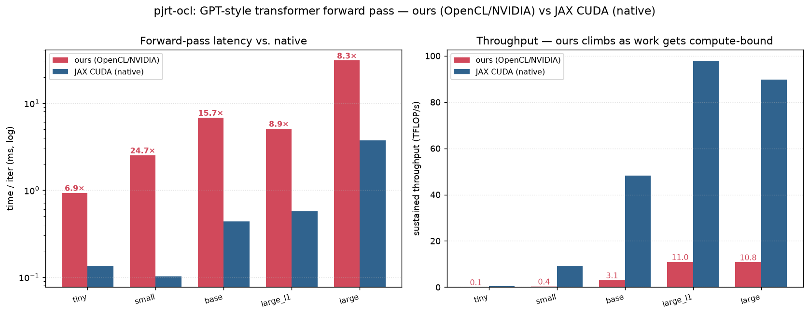
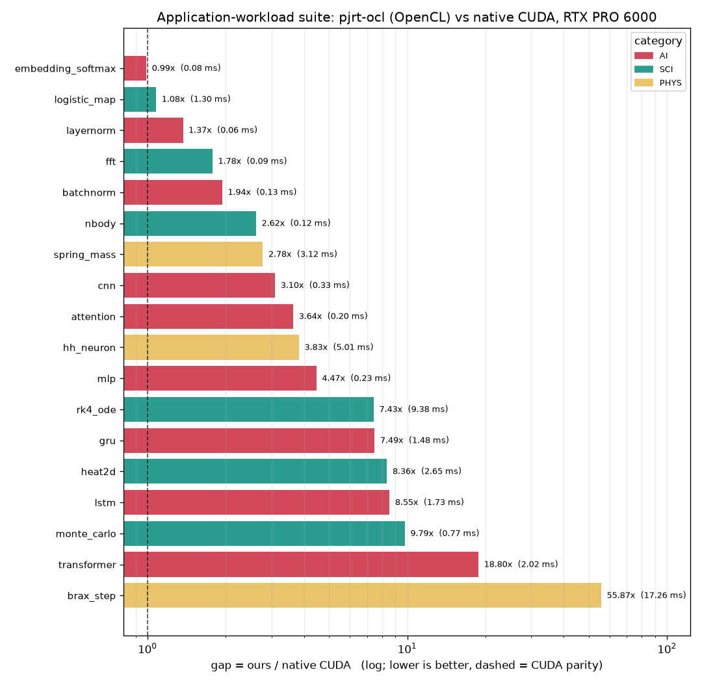

# OpenMegaKernel (pjrt-ocl)

**Run JAX on any OpenCL device.** `pjrt-ocl` is a [PJRT](https://openxla.org/xla/pjrt)
plugin that lets `jax.jit` execute on OpenCL-capable hardware — Intel, AMD, NVIDIA,
or a CPU via [PoCL](https://portablecl.org/) — with no vendor SDK (no CUDA, no ROCm)
on the execution path.

> ⚠️ **Experimental / work in progress.** A growing subset of StableHLO ops across the
> full JAX dtype matrix (f32/f64/i32/u32/i64/bool/f16/bf16), not yet on PyPI. Validated
> end-to-end on an NVIDIA RTX PRO 6000 (via NVIDIA's OpenCL), an Intel Arc 140V
> **Xe2** iGPU, and on PoCL (CPU) — see the
> [known Xe2 `softmax` bug](#intel-arc-140v-xe2-lunar-lake-igpu--vs-jax-cpu). Not
> affiliated with Google, OpenXLA, or the JAX project.
>
> **Workload coverage:** a diverse testbench of **18 AI + scientific + physics workloads**
> (`tools/bench_suite/`) — MLP, CNN, LSTM/GRU, transformer, attention, batch/layer-norm,
> embeddings; heat-PDE, N-body, RK4, Monte-Carlo (`jax.random`), FFT; spring-mass,
> Hodgkin-Huxley, and a real **MuJoCo/brax** physics rollout — **all 18 run correct vs native
> CUDA.** See [`docs/workload-coverage.md`](docs/workload-coverage.md).

## How it works

JAX lowers your `jit`-compiled function to StableHLO. Instead of JIT-compiling a kernel
per dispatch, `pjrt-ocl` lowers StableHLO **once** into a compact **bytecode** — a flat
list of tile-ops with a per-lane schedule. At run time a single persistent OpenCL
megakernel (the "VLIW VM") interprets that bytecode: each workgroup is a *lane* running
its own instruction stream, with different lanes running different ops in parallel and
synchronizing at scheduler-placed barriers. The generic OpenCL kernel library is compiled
**once** per device at plugin init — the OpenCL compiler is never invoked on the hot path.

```
jax.jit(f)  ──►  StableHLO  ──►  lowering (Python)  ──►  VMProgram bytecode
                                                              │
                                          device-side bytecode VM (one megakernel)
                                                              ▼
                                                     results on the OpenCL device
```

## Requirements

- Python ≥ 3.10, with `jax` / `jaxlib` installed (developed against **jax 0.10.2**).
- An OpenCL 1.2+ runtime and an ICD for your device. Check with `clinfo -l`.
  - NVIDIA: the CUDA driver ships an OpenCL ICD.
  - CPU dev/testing: `sudo apt install pocl-opencl-icd`.
- To build the plugin: a C++20 compiler, `cmake`, `ninja`, and OpenCL headers
  (`sudo apt install opencl-headers ocl-icd-opencl-dev cmake ninja-build clinfo`).

## Installation

`pip install` builds the C++ plugin (via cmake/scikit-build-core) and bundles it with
the Python package — no manual build step. You need the build prerequisites on the
system first: **cmake, ninja, and OpenCL dev headers** (Ubuntu:
`sudo apt install cmake ninja-build opencl-headers ocl-icd-opencl-dev`), plus an ICD
for your device (see [Requirements](#requirements)).

```bash
pip install "git+https://github.com/llandsmeer-ai/pjrt-ocl.git"
```

That's it — the `JAX_PLATFORMS=opencl` example below works immediately.

<details>
<summary>Development install (editable, no rebuild-on-edit for the C++)</summary>

For hacking on the plugin, build the `.so` and use an editable Python install:

```bash
git clone https://github.com/llandsmeer-ai/pjrt-ocl.git && cd pjrt-ocl
cmake -S pjrt_plugin -B pjrt_plugin/build -G Ninja && cmake --build pjrt_plugin/build
pip install -e python/    # finds the .so in the build tree automatically
```

The loader searches `PJRT_OCL_PLUGIN_PATH` → the `.so` bundled in the package → the
dev build tree, and prints a clear error if none is found.
</details>

Check JAX sees the device:

```bash
JAX_PLATFORMS=opencl python -c "import jax; print(jax.devices())"
# [OclDevice(id=0)]   # .device_kind shows the platform/device name string
```

## Quickstart

```python
import os
os.environ["JAX_PLATFORMS"] = "opencl"      # use the OpenCL backend

import jax, jax.numpy as jnp

@jax.jit
def f(a, b):
    return jnp.maximum(a @ b, 0.0)          # matmul + relu, fused on device

x = jnp.ones((256, 128), jnp.float32)
w = jnp.ones((128, 64),  jnp.float32)
print(f(x, w).shape)                         # (256, 64)
```

### Choosing a device

`pjrt-ocl` picks the first GPU (else the first CPU) by default. Override with a platform
name substring and optional device index:

```bash
PJRT_OCL_DEVICE="NVIDIA"        python your_script.py   # NVIDIA CUDA OpenCL
PJRT_OCL_DEVICE="Portable"      python your_script.py   # PoCL (CPU)
PJRT_OCL_DEVICE="Intel:1"       python your_script.py   # 2nd Intel device
```

## Supported ops

52 StableHLO ops, grown test-first — each verified against JAX's CPU backend. Full
scoreboard: [`tests/SCOREBOARD.md`](tests/SCOREBOARD.md).

- **Elementwise** — add, subtract, multiply, divide, remainder, pow, max, min, atan2;
  negate, abs, sign, exp, expm1, log, log1p, sqrt, rsqrt, cbrt, sin, cos, tan, tanh,
  floor, ceil, round (even & away-from-zero), is_finite; clamp; and/or/xor/not;
  compare (all directions), select.
- **Type** — `convert` (any dtype ↔ any dtype), `bitcast_convert`.
- **Shape** — `broadcast_in_dim`, `transpose`, `reshape`, `slice` (strided), `reverse`,
  `concatenate`, `pad` (as strided gathers/scatters).
- **Dynamic indexing** — `dynamic_slice`, `dynamic_update_slice`.
- **Reductions** — `reduce` (full sum / max / min / prod, f32 & i32), `reduce_window`
  (pooling, with strides & padding).
- **Linear algebra** — `dot_general` (plain 2D matmul, register-blocked tile kernel).
- **Making** — `iota`, `constant`.
- **Control flow** — `while` (interpreted on device by a frame-stack VM).

**Dtypes** — f32, f64 (where `cl_khr_fp64` is present), i32, u32, i64, bool, f16, bf16.
f16/bf16 use 2-byte storage with f32 compute (portable, no `cl_khr_fp16` required).

Anything unsupported raises a clear `LoweringError` naming the op.

## Hardware tested & benchmarks

Correctness comes first; performance is early. Every device below runs the full
test suite (407 tests: op families x the dtype matrix + e2e); benchmarks are
per-op wall-clock vs problem size N so you can judge whether the library is
worth it for *your* sizes and hardware. New devices go through
[`docs/hardware-bringup.md`](docs/hardware-bringup.md).

Reproduce any plot (writes the `.png` + `.csv`; picks native CUDA as reference
when a CUDA jaxlib is installed, else JAX CPU):

```bash
. ./env.sh && python tools/plot_bench.py --device <platform substring>
# end-to-end transformer sweep (one figure: latency + throughput vs model size):
. ./env.sh && python tools/plot_transformer.py --device <platform substring>
```

**Methodology** (docs/decisions.md §21): each op is applied **16× inside one
jitted program as a data-dependent chain** (`optimization_barrier` between
links so XLA can't fuse/CSE the repeats — and so dead links can't be
eliminated); reported time is per op application, min-of-rounds with rounds
auto-sized to ≥50 ms. This amortizes per-call python/PJRT dispatch (~15–25 µs)
out of BOTH sides — run-to-run deviation is 0.1–0.8% — and both backends
execute one program containing 16 real op instances, which is also each
backend's realistic regime (16 VM instructions for us, 16 kernels in one
executable for XLA). Ratios below are therefore *device-work* ratios; earlier
revisions of these plots included the dispatch floor in both columns, which
flattered whichever side was slower per kernel. The NVIDIA per-op plot uses
this methodology; the Xe2/PoCL per-op plots predate it (one op per call) and
will be regenerated on the next bring-up pass for those devices.

### NVIDIA RTX PRO 6000 (Blackwell) — vs native CUDA

**Testbench: full suite green.** Per-op wall-clock, **our OpenCL backend
against JAX's native CUDA (XLA + cuBLAS) on the same GPU** — an
apples-to-apples GPU-vs-GPU comparison of the VM against a production compiler.


Takeaways (higher = slower; both axes log; ratios are per-op device work,
dispatch-free — see methodology above):

- **Elementwise (add / mul): at or below CUDA across the whole range** —
  0.8–1.0x from 4K to 1M elements, 1.3–1.4x at 2M–8M, and **back to ~0.8x
  (faster than CUDA) at 16M**. An earlier flat ~15 µs/op for ANY mid-range
  N turned out to be the TILE, not the boundary: one 16K-element tile was one
  workgroup's scalar stride-256 loop — 64 dependent memory round trips per
  thread — and the fixed tile size capped an op's parallelism at N/16K lanes.
  The float4+unroll fast path plus a device-tuned tile size (EW_TS 4096 on
  GPUs, decisions.md §22) removed that floor; per-instruction overhead itself
  is ~2.5 µs, at CUDA's in-graph launch floor. The small residual bump at
  2M–8M is CUDA's chain staying L2-resident where our arena traffic does not,
  and it closes again once both sides go to HBM at 16M — where our tile is
  bandwidth-bound and edges CUDA out.
- **`gather` (`dynamic_slice`)** ~2.3–2.9x (was 2.6–7.8x): the contiguous
  rank-1 fast path replaced a per-element div/mod chain (§22). The remaining
  flat ~12 µs/op is the chain's scalar offset arithmetic — several one-element
  instructions + barrier phases per link — i.e. small-op fusion territory
  (§19), not the copy itself.
- **`matrix × vector`** ~1.4–3.0x (was 4.3–46x, the worst table entry): GEMV
  no longer runs through the 64×64 matmul tile (63/64 of every tile wasted at
  N=1, serial K loop). `dot_general` with a vector rhs now lowers to the
  segmented-reduce tile in **dot mode** — one matrix row per tile, the whole
  workgroup doing a coalesced float4 dot + local tree, M-way parallel
  (§22.4). 1024²: 101 → 8.0 µs (cuBLAS: 3.3, L2-resident).
- **`dot_general`.** Large matmul runs a **standalone kernel launched outside
  the megakernel** (so a big register tile isn't capped by the persistent
  barrier's co-residency). On NVIDIA that's `mm_tc`, a tuned **inline-PTX TF32
  WMMA** tile (`mma.sync`, float4-coalesced smem staging, double-buffered) —
  **~43 / 52 TFLOP/s at 2048³ / 4096³**, 2.2× the prior scalar tile (tf32 ≈ 1e-3
  relative precision, the same trade cuBLAS makes by default). A
  `PJRT_OCL_MM_HYBRID` mode routes a real program's big matmuls to it:
  **`large` transformer 27.7 → 18.8 ms (1.48×, gap vs cuBLAS 7.5× → 5.2×)** on
  compute-bound configs (small ones regress — their matmuls don't fill the SMs).
  - **fp16 WMMA closes it further.** `PJRT_OCL_MM_FP16=1` swaps the TF32 WMMA
    for `mma.sync.m16n8k16` + `ldmatrix` at 2× tensor rate and
    tf32-equivalent (10-bit) mantissa — **92 → 107 TFLOP/s, ~1.25× under
    cuBLAS** (§38a). That is as close as portable OpenCL reaches.
  - **The residual under cuBLAS is a root-caused *portable* ceiling, not an
    effort ceiling.** The tile is **register-file-capped at 2 workgroups/SM**
    (a 128×128 f32 accumulator is 16384 registers; it can't grow), and the one
    mechanism that hides the resulting memory latency — **`cp.async`** (Ampere+
    async global→shared copy) — **is not wired up by NVIDIA's OpenCL runtime**:
    the driver emits correct PTX but the async unit never delivers data
    (verified at the PTX level; CUDA-only). So cuBLAS-class matmul is
    *fundamentally unreachable* from portable OpenCL — the honest matmul ceiling
    of a no-vendor-SDK design. Full analysis in `docs/decisions.md §31–§38a`.
- **`while` loops: faster than CUDA up to ~1M elements (~115x below 256K,
  0.65–0.8x at 512K–1M), ~1.0–1.2x above.** The counted-loop pipeline (`OP_FOR`
  + bytecode unroll, §15) plus affine-chain composition folds the 32-step
  `x*1.5+1` body into a handful of instructions at compile time (~1.6 µs/op),
  while XLA GPU runs a real device-synchronized loop (~184 µs/op regardless
  of N). Past the unroll arena gate (~512K) we run the loop for real — 32
  in-kernel iterations of a vectorized affine tile + barrier now cost 121 µs
  vs CUDA's 187 µs of launch-bound iterations (was 466 µs before §22's tile
  fixes; the megakernel's in-kernel loop is a genuine structural win here).
- **`lax.scan` (stacked outputs) ties XLA CPU at 1M elements.** The
  dynamic_update_slice that stacks each step's output used to re-copy the
  whole ys buffer every iteration (O(T²·n) traffic); the in-place-DUS fold
  (§15a) scatters the row straight into the loop carry instead. Scan-RNN
  1M×T8: 1.11 ms vs XLA CPU's 1.09; 1M×T32: 4.84 vs 4.84 (FOR mode; 2× over
  the copying path on NVIDIA, up to 15× on PoCL host-dispatch).

With the §22 tile fixes in, single big ops are at or near parity and the
per-instruction overhead (~3 µs) sits at CUDA's launch floor; what remains
expensive is *chains of small ops* (scalar index arithmetic, layernorm/softmax
idioms) — many instructions and barrier phases where XLA emits one fused
kernel. Fusing more work into fewer instructions (§19) attacks exactly that.

#### End-to-end: a GPT-style transformer (`tools/bench_transformer.py`)

A realistic forward pass — batched multi-head attention, layernorm, GELU FFN,
residuals (random weights) — run through the full plugin and checked against a
JAX-CPU reference (`--check`, f32-exact on the portable path). This is the
apples-to-apples "does a real workload work, and how close are we?" test.
NVIDIA (TF32 tensor cores on), vs native JAX CUDA on the same GPU
(`tools/plot_transformer.py`):



| config (D, ff, layers) | ours | native CUDA | gap | ours throughput |
|------------------------|------|-------------|-----|-----------------|
| base (512, 2048, 6)    | 5.4 ms | 0.43 ms | 12.5× | 3.9 TFLOP/s |
| large_l1 (1024, 4096, 1) | 4.5 ms | 0.56 ms | 7.9× | 12.5 TFLOP/s |
| large (1024, 4096, 6)  | 27.3 ms | 3.8 ms | **7.3×** | **12.3 TFLOP/s** |

The gap **shrinks as the model gets compute-bound** (and holds at full depth):
`base`'s 12× is small-op/overhead-bound, not a matmul deficit — on compute-heavy
work we sustain **~12.5 TFLOP/s within ~7× of cuBLAS**. `base` came down 9.7 → 5.3
ms over a campaign of general mechanisms, each of which helps any workload:
segmented (workgroup-collaborative) reductions for softmax/layernorm; an
**access-map fusion** pass that folds transposes/reshapes/broadcasts into the
consuming operand's strided read (no materialization, no barrier); **arena
liveness-reuse** (bounds device memory by peak live set, not the sum of all
temporaries — cut the `base` arena 716→105 MiB and unblocked `large` entirely,
which otherwise overflowed the address space); TF32 tensor-core matmul with a
bank-conflict-free staging tile; **per-tile latency fixes** (float4 EW, a proper
GEMV — §22, 9.7 → 6.8 ms); **fused normalization ops** (§19) that recognize the
layernorm/softmax `reduce→broadcast→…` idiom and collapse it into a single
workgroup-per-segment kernel — one global round-trip instead of 5–7 latency-bound
phases (layernorm 7→2 barriers, softmax 5→0; standalone softmax now *beats* native
CUDA; 6.8 → 5.8 ms); and a **fused `OP_GELU`** opcode (§24/§26) that computes the
whole tanh-approx GELU per element in registers (8 ops → 1, 5.8 → 5.3 ms). After
this campaign, a decomposition of the remaining time (`docs/decisions.md §29–§36`)
shows the residual gap is **almost entirely matmul** (non-matmul is fused down to
~8%): our per-op kernels are competitive, but the tensor-core matmul is at the
**portable ceiling** — cuBLAS's edge comes from `cp.async`, which NVIDIA's OpenCL
runtime doesn't expose (§35), so cuBLAS-class matmul is unreachable without a
vendor SDK. The `PJRT_OCL_MM_HYBRID` standalone-matmul path claws the *compute-bound*
end back (`large` gap **7.5× → 5.2×**); the small-model overhead-bound end is a
known, documented hard case. This is an honest, measured ceiling for a
portable-OpenCL design, not a to-do.

#### Application-workload suite (`tools/bench_suite/`)

Beyond single ops and one transformer, an **18-workload testbench** spanning AI,
scientific computing, and physics — each a small but complete `jax.jit` program,
run end-to-end through the plugin and checked against native CUDA on the same GPU
(`tools/bench_suite/run_suite.py`; per-workload notes and correctness in
[`docs/workload-coverage.md`](docs/workload-coverage.md)). **All 18 run correct
vs CUDA.** Same measurement as everywhere else — each backend in its own
subprocess, median-of-rounds, `gap = ours_ms / cuda_ms`:



| workload | cat | gap | | workload | cat | gap |
|---|---|---|---|---|---|---|
| embedding_softmax | AI | **0.99×** | | mlp | AI | 4.47× |
| logistic_map | SCI | 1.08× | | rk4_ode | SCI | 7.43× |
| layernorm | AI | 1.37× | | gru | AI | 7.49× |
| fft | SCI | 1.78× | | heat2d | SCI | 8.36× |
| batchnorm | AI | 1.94× | | lstm | AI | 8.55× |
| nbody | SCI | 2.62× | | monte_carlo | SCI | 9.79× |
| spring_mass | PHYS | 2.78× | | transformer | AI | 18.80× |
| cnn | AI | 3.10× | | brax_step | PHYS | 55.87× |
| attention | AI | 3.64× | | | | |
| hh_neuron | PHYS | 3.83× | | **median** | | **3.83×** |

The spread maps cleanly onto the [root causes](#hardware-tested--benchmarks)
above. **Memory-bound / fusion-friendly workloads sit at parity** — a fused
`embedding_softmax` ties CUDA, `layernorm`/`logistic_map`/`fft`/`batchnorm` land
within ~2×, because there's no matmul ceiling to hit and our single-megakernel
fusion competes with XLA's multi-kernel dispatch. **Matmul-heavy** work
(`transformer`, `mlp`, `cnn`) carries the `cp.async` matmul gap (§35); **long
sequential `scan`** workloads (`lstm`/`gru`/`rk4`/`heat2d`/`monte_carlo`) pay a
per-step barrier-phase tax XLA amortizes into fused kernels. `brax_step` is the
outlier — a real MuJoCo/brax `reset+step` is hundreds of tiny data-dependent
control-flow ops, the exact host-dispatch-bound regime; that it runs *correct*
end-to-end (past the ui32 dtype fix, §42) is the milestone, and closing its
latency is future scan/control-flow fusion work.

### Intel Arc 140V (Xe2, Lunar Lake iGPU) — vs JAX CPU

**Testbench: full suite green** (407 tests; `intel-opencl-icd` 26.22) and the
**18-workload application suite is 18/18 PASS with zero missing ops**
(`docs/workload-coverage-xe2.md`). No native JAX plugin exists for this iGPU,
so the reference is JAX's XLA **CPU** backend on the same package (Core Ultra
9 288V) — cross-device but honest: it's the alternative you'd actually use.

> ⚠️ **Known correctness bug on Xe2: `softmax` can return wrong results.**
> The fused softmax kernel is non-deterministic *across processes* — e.g.
> `jax.nn.softmax` on a (64,10) f32 array is wrong in ~14 of 16 runs, corrupting
> a run of tail rows. The error (~5e-3 on ~0.1 values) is small enough to slip
> under the test suite's tolerance, which is why everything above still reports
> green. PoCL is unaffected. Bisected to `TOP_SOFTMAX_SEG`; **not yet fixed** —
> details and a reproducer in `docs/decisions.md` §50. Treat Xe2 softmax (and
> anything built on it) as suspect until then. Flash-attention uses a separate
> kernel and is not implicated.


- **This iGPU defaults to the host-dispatch engine, not the persistent
  megakernel.** Xe2 has only **32 co-resident workgroups** (measured, poc/08):
  the megakernel's parallelism is capped at residency while its cross-workgroup
  spin-barrier is pure overhead, whereas a host-launched kernel gets a full
  oversubscribed grid the driver latency-hides across the XVEs. Measured
  head-to-head, host-dispatch matmul is **5–8x faster** than the megakernel on
  Xe2 (and avoids a `CL_OUT_OF_RESOURCES` the megakernel trips on long
  chained-matmul dispatches). The "auto" engine picker now flips any GPU whose
  measured residency is below a threshold to host-dispatch; big discrete GPUs
  (NVIDIA: hundreds of lanes) keep the megakernel. `PJRT_OCL_ENGINE=mega`
  forces it back. See `docs/decisions.md` §44.
- **Large arrays are where the iGPU pays off**: elementwise at 16M runs
  **~2.1–2.4x faster** than XLA CPU. Both backends *fuse* the benchmark's
  elementwise chain into ~one memory pass (ours costs 1.25x a single add for
  16 chained adds, not 16x), so this is an honest bandwidth-vs-bandwidth
  comparison: ~76 GB/s for us against the shared LPDDR5X's ~136 GB/s
  theoretical peak. Streaming ops sit at that same ~75 GB/s ceiling
  (`dynamic_slice` included) — headroom remains.
- **`dot_general` is faster than XLA CPU at every measured size** — 1.2x at
  128³, 1.5–1.9x through 768³, and **2.4–2.7x from 1024³ to 2048³**
  (11.7 ms at 2048³ = **~1.47 TFLOP/s**). Two fixes got it there, both in
  `docs/decisions.md` §45–§46: the SGEMM's staged K-block was halved
  (`MM2_BK` 16→8 — an *occupancy* win, not a register one: it halves
  local-memory per workgroup so twice as many stay co-resident, poc/19), and —
  the big one — **matmuls embedded in a larger program are now peeled out to
  that SGEMM** instead of crawling on the in-VM tile (574 → 1467 GFLOP/s,
  2.5x). An epilogue-fused variant (`mm2_epi`) is what lets a transformer's
  FFN matmuls (fused bias+gelu / residual add) take that path. Routing is
  gated on compute volume ≥2³⁰ — peeling smaller matmuls regresses them.
  `matrix × vector` is at parity at 2048 via the dedicated `gemv` kernel.
- **`while` loops**: ~2 µs/call scheduler overhead at small N (1.7x *faster*
  than XLA CPU at 4K), within 1.1x at 16M.
- **`gather`/`dynamic_slice` is ~2x behind XLA CPU at 16M**, but it is already
  running at the same ~75 GB/s streaming ceiling as everything else — it is
  bandwidth-bound, not algorithmically bad.
- **Small ops are dispatch-bound** (~10–70 µs wall-clock vs XLA CPU's
  ~1–30 µs): expect 2–6x slower below ~1M elements; batch or fuse small work.
- Bring-up found and fixed a real portability bug: lane count is now *measured*
  at init (occupancy discovery, `docs/decisions.md` §9) instead of derived from
  the vendor-ambiguous `CL_DEVICE_MAX_COMPUTE_UNITS`.

### CPU via PoCL (Intel Core Ultra 9 288V) — vs JAX native CPU

**Testbench: full suite green.** This is a same-silicon CPU-vs-CPU comparison:
our plugin through PoCL's OpenCL against JAX's native XLA CPU backend on the
same 8 cores. It answers "what does the OpenCL detour cost on a CPU?" —


- **PoCL streaming runs at ~56 GB/s single-pass.** CPU OpenCL runtimes only
  auto-vectorize the implicit work-item loop, which our in-kernel tile loops
  defeated — every hot tile body now has an explicit-`float8` CPU variant
  selected by a device-keyed build define (`poc/09-cpu-kernels`,
  `docs/decisions.md` §11). On the chained bench we land **~3.7–4.0x behind
  native XLA CPU** at 16M. Two things drive that, and only one is a kernel
  issue: 56 GB/s is roughly half what the iGPU gets out of the same LPDDR5X,
  *and* our elementwise chain-fusion is much weaker on the CPU path than on
  the GPU one (16 chained adds cost **7.7x** a single add here, versus 1.25x
  on Xe2), so we move more memory traffic than XLA's fully-fused loop.
- **`dot_general` is ~at parity with native XLA CPU at 2048³** (37.0 vs
  42.1 ms) and ~1.4x behind at ≤512³: the packed + KC-blocked CPU SGEMM
  (`poc/10-cpu-sgemm`). Treat the large-matmul comparison as parity rather
  than a win — the XLA CPU reference swung 30→42 ms between runs on this
  host, which is larger than the gap. `PJRT_OCL_MM_CPU=reg` selects the
  simpler register kernel for hardware that prefers it. `gather` pays a
  per-slice host-dispatch launch (~2.9x behind at 16M), `while` is 1.45x
  behind, and `matvec` is at parity; below ~1M elements the PoCL launch floor
  keeps small ops several x slower (host-dispatch phases are batched onto the
  in-order queue; the remaining floor is one `clFinish` + PoCL's per-command
  cost).
- If your machine has *any* supported GPU — including an iGPU — prefer it
  (see below). PoCL remains the bring-up/debug/CI backend: printf, host
  debuggers, and sanitizers all work there.

### CPU vs GPU, same machine (Lunar Lake), both through pjrt-ocl

The two backends above share silicon and memory (LPDDR5X); here they are
against each other — GPU (red) vs CPU (blue), both running the identical
bytecode through this plugin
(`tools/plot_bench.py --compare docs/bench_plot_xe2.csv docs/bench_plot_pocl.csv`):


- Both run the identical bytecode on shared LPDDR5X, yet the iGPU wins
  everywhere: **~8.5x** on elementwise at 16M (32 XVEs outpace 8 CPU cores on
  the same memory), **1.5x** on `gather`, **1.4x** on the `while` loop, **1.1x**
  on `matvec`, and **2.6x** on `matmul` at 768³ rising to **3.2x** at 2048³
  after the §45–§46 matmul work.
- Practical guidance: on any machine with a working GPU ICD, the default
  device selection (first GPU) is the right choice — it never loses, and wins
  big on compute-dense programs. Select PoCL explicitly
  (`PJRT_OCL_DEVICE=Portable`) for debugging (printf/sanitizers) or
  CI-without-GPU.

## Inside the VM: scheduled vs. measured execution

How does a `jax.jit` function actually run on the device? Take a program with both
parallel and sequential structure — a heavy matmul next to a cheap elementwise chain,
joined at the end:

```python
def f(a, b, c):          # all 256x256 f32
    m = a @ b            # heavy matmul (shaped)    \  runs in parallel with the
    s = c + c            # elementwise               } elementwise chain s,p,q, which
    p = c * c            # elementwise               } fuses onto lanes with NO barrier
    q = s * p            # elementwise (needs s,p)  /  (same-index deps chain per tile)
    return q + m         # needs m (shaped) -> the one real barrier: the join
```

The compile pipeline turns this into the per-lane schedule below. Lowering emits one
**task** per op and splits each into **tiles** (16K elements for elementwise, 64×64
output blocks for matmul). The scheduler groups ops into **phases**: independent ops and
same-index elementwise **chains** share a phase — a chain runs on one lane per tile, so a
dependency like `q = s * p` costs no barrier, only a cheap thread-local re-read. A **shaped**
op (matmul/reduce/gather — its output reshuffles tiles across lanes) is the only thing that
forces a phase boundary. It packs each phase's tiles onto **lanes** (persistent workgroups)
by cost (LPT) and separates phases with **global barriers** — so `s, p, q` run barrier-free
alongside the matmul and only the final join (which needs `m`) pays a barrier. That schedule
*is* the bytecode the engines execute. (`PJRT_OCL_FUSE=0` reverts to one barrier per level.)

A schedule is only as good as its cost model, so the plugin **measures** it rather than
assuming one. On first use it runs a µbenchmark per tile-op family on the actual device
(two tile counts, slope, so launch overhead cancels), caches the result under
`~/.cache/pjrt-ocl/` keyed by device+driver, and every subsequent compile schedules with
those costs — on this CPU `ew=310 mma=5073 reduce=89 gather=201` µs/tile (a matmul tile
really costs **~16×** an elementwise one), on the NVIDIA GPU
`ew=15 mma=27 reduce=13 gather=21` (nearly uniform — same program, opposite balance). It
matters: a naive unit-cost model dedicates whole lanes to the cheap elementwise ops, which
then finish in under a millisecond and stall at the barrier while the matmul lanes grind on.

`tools/plot_schedule.py` draws the calibrated schedule (top, the scheduler's intent on the
device's measured clock), then runs the program through the plugin with per-entry
instrumentation and draws what the device really did (bottom, white gaps = bubbles):


Reading it:

- **Level 0**: independent ops run side by side — the matmul's tiles fan out over all
  lanes while `c+c` and `c*c` run concurrently. With measured costs the packer
  **fans the matmul out over every lane** and **sequentializes the cheap elementwise ops
  behind its chunks** instead of dedicating lanes to them.
- The dashed **barriers** separate levels: `s * p` and the final join each wait for
  every lane, because their inputs were produced across lanes.
- The planned and measured panels agree structurally; the remaining idle lane-time (~20%)
  is the CPU runtime's own per-workgroup jitter, not scheduling.

On shapes where cheap ops would otherwise steal lanes from a matmul (e.g. one matmul
+ seven small elementwise ops), the calibrated schedule is ~1.3× faster end-to-end on
PoCL. Override knobs: `PJRT_OCL_COST_TABLE=<json>` (explicit table),
`PJRT_OCL_CALIBRATE=0|1` (disable / force re-measure).

Reproduce (any of `diamond`, `chain`, `wide`, or your own StableHLO):

```bash
. ./env.sh
python tools/plot_schedule.py --example diamond --device Portable \
    --out docs/schedule_diamond_calibrated.png                 # measured costs (default)
python tools/plot_schedule.py --stablehlo my_program.mlir      # planned timeline only
```

How the measurement works: `PJRT_OCL_VM_TRACE=<file>` switches execution to the
host-dispatch engine and runs **every schedule entry as its own single-workgroup
launch on a per-lane profiling queue** (lanes still run concurrently — verified on
PoCL and NVIDIA), so each entry gets device-clock start/end timestamps via OpenCL
event profiling, appended as JSON per execute. Two caveats: per-entry launches add
overhead (~tens of µs each), so treat it as a timeline, not a benchmark — and the
GPU megakernel path is not per-entry observable from the host (only barrier arrival
ranks), so traces always reflect the host-dispatch engine.

## Development

```bash
# C++ unit test (executes hand-built bytecode on the device)
cmake --build pjrt_plugin/build && ./pjrt_plugin/build/runtime_test

# Python + end-to-end tests (compares every op against JAX's CPU backend)
pip install -e python/ && python -m pytest tests/

# Per-op perf sweep (lane scaling + vs JAX CPU)
tools/bench_ops.sh
```

The codebase targets OpenCL 3.0-core / the common 1.2 subset; no vendor extensions on the
core path, and it never assumes fp64. Design decisions and their rationale live in
[`docs/decisions.md`](docs/decisions.md); the bytecode format is specified in
[`docs/vmprogram.md`](docs/vmprogram.md) and the execution model in
[`docs/tile-isa.md`](docs/tile-isa.md).

## Limitations & roadmap

- **Op coverage is partial** and grows test-first. Now in: innermost-suffix partial
  reductions (softmax/layernorm) and batched / broadcast `dot_general` (attention, `x@W`).
  Not yet: non-suffix reductions and non-canonical `dot_general` (both need an operand
  transpose first), `if`/`case` control flow, general (data-dependent) gather/scatter, sort.
  These raise a clear `LoweringError` today.
- **Dtypes**: the full JAX matrix (f32/f64/i32/u32/i64/bool/f16/bf16) is in; f64 is gated
  on `cl_khr_fp64`. Still to come: i8/i16 and complex.
- **Two execution engines, auto-selected.** GPUs run a persistent megakernel with an
  on-device cross-workgroup barrier (device-scope acquire/release fences — correct even for
  cross-lane data under iteration). CPU/non-GPU devices (e.g. PoCL) use a **host-dispatch**
  engine instead: the host drives control flow and enforces the barrier with one kernel
  launch per phase. This is required on CPU — an in-kernel spin-barrier deadlocks on a
  non-preemptive CPU runtime (imbalance-starvation; it's why OpenCL mandates kernel
  boundaries for cross-group sync). Override with `PJRT_OCL_ENGINE=host|mega|auto`.
- Performance is improving but not yet tuned. Elementwise/gather are near CUDA;
  large matmul uses a standalone SGEMM but full parity needs TF32 tensor cores
  (inline-PTX WMMA behind the kernel-table override — not yet built); `while` is
  down to ~4x via affine folding + in-place carries (see `docs/decisions.md` §9).

## References

Sources this project drew on, by topic. (Design rationale that cites these lives in
[`docs/decisions.md`](docs/decisions.md).)

**PJRT & the XLA plugin interface**
- PJRT C API header — [openxla/xla `xla/pjrt/c/pjrt_c_api.h`](https://github.com/openxla/xla/blob/main/xla/pjrt/c/pjrt_c_api.h) (vendored at a pinned commit)
- [PJRT overview](https://openxla.org/xla/pjrt) and [PJRT integration guide](https://openxla.org/xla/pjrt/pjrt_integration)
- [StableHLO specification](https://openxla.org/stablehlo/spec) — op semantics we lower from
- [JAX](https://github.com/jax-ml/jax) — the frontend; plugins register via a `jax_plugins` entry point

**OpenCL runtime & the cross-workgroup barrier (the project's #1 risk)**
- [PoCL — Portable Computing Language](https://portablecl.org/) (our CPU/debug backend); its CPU pipeline uses **Continuation-Based Synchronization** ([PoCL papers](https://portablecl.org/publications.html)), i.e. kernel-boundary barriers — the basis of our host-dispatch engine
- T. Sorensen, A. F. Donaldson, et al., **"Portable Inter-Workgroup Barrier Synchronisation for GPUs"**, OOPSLA 2016 — occupancy-bound execution; why an in-kernel spin-barrier needs all workgroups co-resident (and deadlocks on a non-preemptive CPU runtime)
- [The OpenCL Specification (Khronos)](https://www.khronos.org/registry/OpenCL/specs/) — memory model, atomics/fences, and the rule that cross-workgroup sync is a kernel boundary

**Persistent-megakernel design (VM + scheduler inspiration)**
- HazyResearch **Megakernels** — [github.com/HazyResearch/Megakernels](https://github.com/HazyResearch/Megakernels) and the blog posts [*No Bubbles* (Llama-1B)](https://hazyresearch.stanford.edu/blog/2025-05-27-no-bubbles) and [*Whole GPU* (TP-Llama-70B)](https://hazyresearch.stanford.edu/blog/2025-09-28-tp-llama-main) — per-block instruction streams, fine-grained dependency counters instead of a grid barrier, warp specialization
- [ThunderKittens](https://github.com/HazyResearch/ThunderKittens) — the tile-abstraction lineage

**Matmul & TF32 tensor cores from OpenCL (inline PTX)**
- [ihavnoid/hgemmtest](https://github.com/ihavnoid/hgemmtest) — WMMA tensor cores invoked via inline PTX from OpenCL C
- [sschaetz/nvidia-opencl-examples `oclInlinePTX`](https://github.com/sschaetz/nvidia-opencl-examples) — minimal inline-PTX-from-OpenCL syntax
- [alexarmbr/matmul-playground](https://github.com/alexarmbr/matmul-playground) + blog [*How To Write A Fast Matrix Multiplication From Scratch With Tensor Cores*](https://alexarmbr.github.io/2024/08/10/How-To-Write-A-Fast-Matrix-Multiplication-From-Scratch-With-Tensor-Cores.html) — tiling, swizzling, `ldmatrix`/`mma.sync` fragment layouts
- [NVIDIA CUTLASS](https://github.com/NVIDIA/cutlass) (`arch/mma_sm80.h`) — the authoritative TF32 `mma.sync.aligned.m16n8k8.row.col.f32.tf32.tf32.f32` string
- [NVIDIA PTX ISA](https://docs.nvidia.com/cuda/parallel-thread-execution/) — `wmma`/`mma.sync`/`ldmatrix`/`cvta` semantics and fragment→register maps

**Compiler fusion (the access-map principle, §13)**
- XLA operator fusion (`kLoop` / `kInput`) — inline elementwise + broadcast up to a reduction boundary; the model our access-map fusion follows
- The polyhedral / loop-fusion view (iteration domains + access relations) — fuse an edge where the access is a *function*, not a many-to-one relation

**Baselines & tooling**
- cuBLAS / XLA:GPU (the CUDA reference in the benchmarks), [Eigen](https://eigen.tuxfamily.org/) (the XLA:CPU matmul baseline)

## License

TBD.
